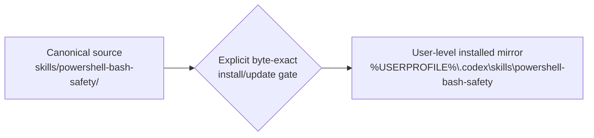

# PowerShell 与 Bash 安全执行设计

## 状态

- 项目权威位置：repository root（`.`）。
- 项目意图权威：[docs/blueprint.md](docs/blueprint.md)。
- Canonical Skill：`skills/powershell-bash-safety/`。
- 用户级安装目录是独立 deployment mirror，不是源码 authority。
- 首版 canonical package 由当时已安装三文件 byte-exact 物化；当前源码候选新增内置 PowerShell AST 验证器和 Windows bootstrap reference，因此不再与旧 installed mirror byte-exact。

## 目标

维护一个可复用、可验证的跨平台 Shell 安全 Skill，把 PowerShell、native argv、SSH、Bash/POSIX sh、archive、transport、Compose/container 和 runtime 分成独立 gate，减少多层解释与字节漂移造成的重复失败。

## 核心原则

- 前一 gate 的 PASS 不替代后一 gate 的证据。
- 同一变量只由预定层展开，动态值不直接插入 shell program text。
- parser、byte identity、transport、dry-run 与 runtime 结论分别报告。
- 失败保留首个根因；不通过换 shell、静默转码、跳过清单或重复启动绕过。
- `ROLLED_BACK` 不等于新建 target 已不存在；下一次执行前必须 fresh 核对残留与 identity。

## Authority 与 deployment

- Canonical source 决定 Skill 内容。
- Installed mirror 只代表当前用户环境的 deployment state。
- 不使用 Junction 或 Symlink 把两者合并为同一文件系统对象。
- source 修改、validation、Git checkpoint、安装和真实使用分别需要适当证据与权限。

## 文档导航

| 文档 | 用途 | 受众 | 状态 | 唯一权威 |
| --- | --- | --- | --- | --- |
| [项目蓝图](docs/blueprint.md) | 项目意图、范围、成功结果与长期约束 | 项目决策者、维护者 | current | 项目意图 |
| [README](README.md) | 使用入口、能力与用户可见限制 | Skill 用户 | current | 用户入口 |
| `DESIGN.md` | 简洁设计、authority 边界与文档导航 | 维护者、审查者 | current | 设计入口 |
| [架构说明](docs/architecture.md) | 执行层、gate、interpreter 与证据边界 | 实施者、审查者 | current | 详细架构 |
| [消费者前向测试计划](docs/consumer-forward-test-plan.md) | 角色/授权深度的项目级测试证据 | 项目维护者、D10 | current / project-only | 消费者测试合同；不进入 portable package |
| [项目规则](AGENTS.md) | Swift Cycle 绑定、维护硬门与 Git 边界 | Agent、维护者 | current | 项目执行规则 |
| `skills/powershell-bash-safety/` | Portable Skill 指令、参考与 syntax adapters | Skill 用户、维护者 | current | Canonical package |
| `tests/` | Adapter 行为与项目级合同验证 | 维护者、审查者 | current / project-only | 离线测试 |
| `TODO.md` / `DEVLOG.md` | 当前行动、失败与维护证据 | 本地维护者 | local / ignored | 本地执行记录；不进入 Git checkpoint |

## 验证策略

1. `quick_validate.py` 验证 Skill package 结构。
2. 新 PowerShell 脚本先由既有 AST gate 检查，再由 canonical adapter 自检；adapter specs 共 28 个 fixtures，覆盖 valid/invalid、bytes、count、duplicate/skip、ReparsePoint、dialect/backend identity、工具缺失、Text/Json、顶层错误与退出码。
3. consumer-depth spec 以 8 个离线合同测试验证三类角色、Fast/Milestone/Target 选择、WSL 显式 gate、只读 reviewer 边界和 portable package 零 task-reference 泄漏。
4. PowerShell AST、Bash `-n`、POSIX sh `-n` 分别验证至少一个非空样本。
5. 检查 reference 路径、UTF-8、BOM、尾空白。
6. 安装同步时比较 relative file set、length、bytes 和 SHA-256。
7. 修改后检查 scope、diff 与未授权 deployment side effects。

## 工具分层

- 必选 syntax gate：PowerShell 自带 `System.Management.Automation.Language.Parser.ParseFile`，离线且零新增依赖。
- 可选静态检查：本机已有 PSScriptAnalyzer 才运行；缺失为 `NOT_RUN`，不自动安装，issues 不替代 AST 结果。
- adapter 测试：Pester 验证 Solis collection/output/exit 行为，不承担 syntax parser 职责。
- 编辑器反馈：PowerShellEditorServices/VS Code PowerShell extension 不进入命令行硬门。
- 未来 CI：Microsoft PSScriptAnalyzer Action 只能在独立 GitHub CI milestone 中采用，本轮没有 workflow、联网或安装授权。

## 条件式验证模式

- `Fast` 是默认：只检查受影响文件，并在一次 adapter 调用内闭合 bytes、count、dialect/interpreter identity 与 parser。
- `Milestone` 只对相关范围增加已可用的 PSScriptAnalyzer/ShellCheck，以及确有相关逻辑测试时的 Pester；工具缺失为 `NOT_RUN`。
- `Target` 仅在发布、部署、真实运行前或明确目标兼容性要求时使用目标 WSL/container/主机 interpreter。
- 这些 gate 是内部条件分支，不等于每次执行完整六层，也不生成多张用户审批卡。Git Bash 证据固定为 Windows local compatibility。

## 消费者角色与授权深度

- 实施者默认对受影响脚本执行 Fast；adapter 或相关逻辑变化时才进入 Milestone。
- Target 由具体目标环境和 action-time authorization 触发，不能由 Skill invocation、角色名称或前一 gate PASS 推导。
- 只读审查者只审阅源码、interpreter contract 和已有证据；只有已存在且无项目写入的 parser/lint 属于可选只读检查，fixture tests、Target backend 和运维执行仍在边界外。
- 代表性 task reference 只属于项目本地测试计划或 Review Packet，不进入 portable Skill package。
- MCP 消息审批、空回传和任务唤醒属于外部协调边界，保持 `UNKNOWN`，不纳入 Shell safety 完成声明。

## Windows bootstrap 边界

- Windows Skill 执行入口固定为 `C:\Program Files\PowerShell\7\pwsh.exe`；缺失时停止并进入一次性 bootstrap 设计，不回退到 `powershell.exe`。
- PowerShell 当前发布渠道、MSI/Wix 或未来 installer 格式必须在 action time 重新核实，不成为永久常量。
- PowerShell 7、Starship、Pastel Powerline、JetBrainsMono Nerd Font Mono、Profile、PATH 与终端默认 Profile 分别授权和验收。
- 不删除 Windows PowerShell 5.1 系统组件，不永久改写系统 PATH；绝对 `pwsh.exe`、命令局部 PATH 和可选终端默认 Profile 是正常使用的优先边界。

详细执行模型见 [docs/architecture.md](docs/architecture.md)。

项目意图与第一里程碑出口见 [docs/blueprint.md](docs/blueprint.md)。
