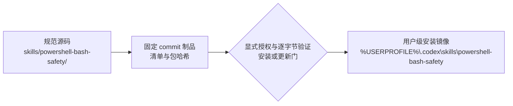

# PowerShell 与 Bash 安全执行设计

## 状态

- 项目权威位置：repository root（`.`）。
- 项目意图权威：[docs/blueprint.md](docs/blueprint.md)。
- 规范 Skill：`skills/powershell-bash-safety/`。
- 用户级安装目录是独立安装镜像，不是源码权威。
- 规范源码与用户级安装镜像保持独立；只有完成显式逐字节同步与验证，才能声明某一安装快照与源码一致。
- 2026-09-23 的本机固定安装已达到 `INSTALLED_LOAD_VERIFIED`，消费入口是普通目录，不跟随开发 checkout。版本/制品身份及后续交付流程统一见 [固定版本交付与更新回退](docs/architecture.md#固定版本交付与更新回退)。

## 目标

维护一个可复用、可验证的跨平台 Shell 安全 Skill，把 PowerShell、原生命令参数、SSH、Bash/POSIX sh、归档、传输、Compose/容器和运行态分成独立验证门，并为已授权 sudo 动作提供不依赖终端的 Windows WPF 一次性遮蔽输入，减少多层解释、字节漂移与凭据误入普通 PTY 造成的失败。

## 核心原则

- 前一验证门的 PASS 不替代后一验证门的证据。
- 同一变量只由预定层展开，动态值不直接插入 Shell 程序文本。
- 解析器、字节身份、传输、试运行与运行态结论分别报告。
- 失败保留首个根因；不通过换 Shell、静默转码、跳过清单或重复启动绕过。
- `ROLLED_BACK` 不等于新建目标已不存在；下一次执行前必须重新核对残留与身份。
- 凭据输入面不是普通 terminal：只有 exact action 已获授权时才显示 WPF `PasswordBox`，任何 GUI、identity、command 或 protocol 不确定性都 fail closed。

## 一次性 sudo 输入设计

`New-SolisSudoActionDigest` 先绑定 authorization ID、destination、absolute target argv、timeout、`MaxOutputBytes`、固定 OpenSSH/helper hashes、`known_hosts` hash 与可选 identity file metadata。`Invoke-SolisMaskedSudoOverSsh` 在 GUI 前校验一次，用户确认后再校验一次，封闭输入期间的 identity/command/output-policy drift。

WPF window 只在 PowerShell 7 STA、interactive Windows session 中启用；两个 `PasswordBox.SecurePassword` 只通过 BSTR code units 比较，不构造完整 plaintext managed string。接受值从 BSTR 进入可清理 `char[]`/UTF-8 `byte[]`，由 stdin `BaseStream` 写入并以单独 LF 终止；SSH `ArgumentList` 禁止 PTY 与 SSH interactive authentication fallback。remote helper 使用 FIFO drain target/sudo streams，target stdin 固定 `/dev/null`；outer SSH user 在 sudo 前创建 mode `0600` status file，避免依赖 root 新建文件的可读性。四个 remote streams 各自受 `MaxOutputBytes` 硬上限约束，Windows transport 也以派生上限并发读取 stdout/stderr；超限返回 `OUTPUT_LIMIT_EXCEEDED`。工作根只包含 FIFO 与 non-secret exit status，并由 trap 精确清理。

返回对象分别保留 `Ssh`、`Sudo`、`Target` 的 exit code/stdout/stderr。protocol 完整不等于 target 成功；真实 GUI foreground、SSH authentication、sudo policy 和 target runtime 都是独立 Target evidence。

## 权威与部署

- 规范源码决定 Skill 内容。
- 安装镜像只代表当前用户环境的部署状态。
- 不使用 Junction 或 Symlink 把两者合并为同一文件系统对象。
- 源码修改、验证、Git 检查点、安装和真实使用分别需要适当证据与权限。
- 普通目录的文件替换与新会话加载验收分开记录；保留的旧 Junction 不是不可变版本快照。回滚核验、空窗与停止条件由架构说明统一定义，不以源码回退代替安装回退。

## 文档导航

| 文档 | 用途 | 受众 | 状态 | 唯一权威 |
| --- | --- | --- | --- | --- |
| [项目蓝图](docs/blueprint.md) | 项目意图、范围、成功结果与长期约束 | 项目决策者、维护者 | 现行 | 项目意图 |
| [README](README.md) | 使用入口、能力与用户可见限制 | Skill 用户 | 现行 | 用户入口 |
| `DESIGN.md` | 简洁设计、权威边界与文档导航 | 维护者、审查者 | 现行 | 设计入口 |
| [架构说明](docs/architecture.md) | 执行层、验证门、解释器与证据边界 | 实施者、审查者 | 现行 | 详细架构 |
| [消费者前向测试计划](docs/consumer-forward-test-plan.md) | 角色/授权深度的项目级测试证据 | 项目维护者、D10 | 现行 / 项目级 | 消费者测试合同；不进入可移植包 |
| [项目规则](AGENTS.md) | Swift Cycle 绑定、维护硬门与 Git 边界 | 智能体、维护者 | 现行 | 项目执行规则 |
| `skills/powershell-bash-safety/` | 可移植 Skill 指令、参考与语法适配器 | Skill 用户、维护者 | 现行 | 规范包 |
| `tests/` | 适配器行为与项目级合同验证 | 维护者、审查者 | 现行 / 项目级 | 离线测试 |
| `TODO.md` / `DEVLOG.md` | 当前行动、失败与维护证据 | 本地维护者 | 本地 / 已忽略 | 本地执行记录；不进入 Git 检查点 |

## 验证策略

1. `quick_validate.py` 验证 Skill 包结构。
2. 新 PowerShell 脚本先由既有 AST 验证门检查，再由规范适配器自检；两个 syntax adapter 规格测试共 28 个测试样本，覆盖有效/无效、字节、计数、去重/跳过、ReparsePoint、方言/后端身份、工具缺失、Text/Json、顶层错误与退出码。
3. `Test-ConsumerDepth.Tests.ps1` 以 8 个离线合同测试验证三类角色、Fast/Milestone/Target 选择、WSL 显式验证门、只读审查者边界和可移植包零任务引用泄漏。
4. `Test-MaskedSudoOverSsh.Tests.ps1` 以 29 个 synthetic tests 覆盖 action/identity/output-policy drift、STA/WPF/session、cancel/empty/mismatch、structured argv、无 console fallback、长 Unicode sentinel、SSH start failure、remote preflight、status ownership、双层输出硬上限、三层 protocol 与 FIFO cleanup。
5. PowerShell AST、Bash `-n`、POSIX sh `-n` 分别验证至少一个非空样本。
6. 检查引用路径、UTF-8、BOM、尾空白。
7. 安装同步时比较相对文件集、长度、字节和 SHA-256。
8. 修改后检查范围、差异与未授权部署副作用。

## 工具分层

- 必选语法验证门：PowerShell 自带 `System.Management.Automation.Language.Parser.ParseFile`，离线且零新增依赖。
- 可选静态检查：本机已有 PSScriptAnalyzer 才运行；缺失为 `NOT_RUN`，不自动安装，问题不替代 AST 结果。
- 适配器测试：Pester 验证 Solis 收集、输出和退出行为，不承担语法解析器职责。
- 编辑器反馈：PowerShellEditorServices/VS Code PowerShell 扩展不进入命令行硬门。
- 未来 CI：Microsoft PSScriptAnalyzer Action 只能在独立 GitHub CI 里程碑中采用；固定安装及交付文档收口不包含 CI 配置授权。

## 条件式验证模式

- `Fast` 是默认：只检查受影响文件，并在一次适配器调用内闭合字节、计数、方言/解释器身份与解析器。
- `Milestone` 只对相关范围增加已可用的 PSScriptAnalyzer/ShellCheck，以及确有相关逻辑测试时的 Pester；工具缺失为 `NOT_RUN`。
- `Target` 仅在发布、部署、真实运行前或明确目标兼容性要求时使用目标 WSL/容器/主机解释器。
- 这些验证门是内部条件分支，不等于每次执行完整六层，也不生成多张用户审批卡。Git Bash 证据固定为 Windows 本地兼容性。

## 消费者角色与授权深度

- 实施者默认对受影响脚本执行 Fast；适配器或相关逻辑变化时才进入 Milestone。
- Target 由具体目标环境和执行时授权触发，不能由 Skill 调用、角色名称或前一验证门 PASS 推导。
- 只读审查者只审阅源码、解释器合同和已有证据；只有已存在且无项目写入的解析器/静态检查属于可选只读检查，测试夹具、Target 后端和运维执行仍在边界外。
- 代表性任务引用只属于项目本地测试计划或审查包（Review Packet），不进入可移植 Skill 包。
- MCP 消息审批、空回传和任务唤醒属于外部协调边界，保持 `UNKNOWN`，不纳入 Shell 安全完成声明。

## Windows 引导边界

- Windows Skill 执行入口固定为 `C:\Program Files\PowerShell\7\pwsh.exe`；缺失时停止并进入一次性引导设计，不回退到 `powershell.exe`。
- PowerShell 当前发布渠道、MSI/Wix 或未来安装器格式必须在执行时重新核实，不成为永久常量。
- PowerShell 7、Starship、Pastel Powerline、JetBrainsMono Nerd Font Mono、Profile、PATH 与终端默认 Profile 分别授权和验收。
- 不删除 Windows PowerShell 5.1 系统组件，不永久改写系统 PATH；绝对 `pwsh.exe`、命令局部 PATH 和可选终端默认 Profile 是正常使用的优先边界。

详细执行模型见 [docs/architecture.md](docs/architecture.md)。

项目意图与第一里程碑出口见 [docs/blueprint.md](docs/blueprint.md)。
