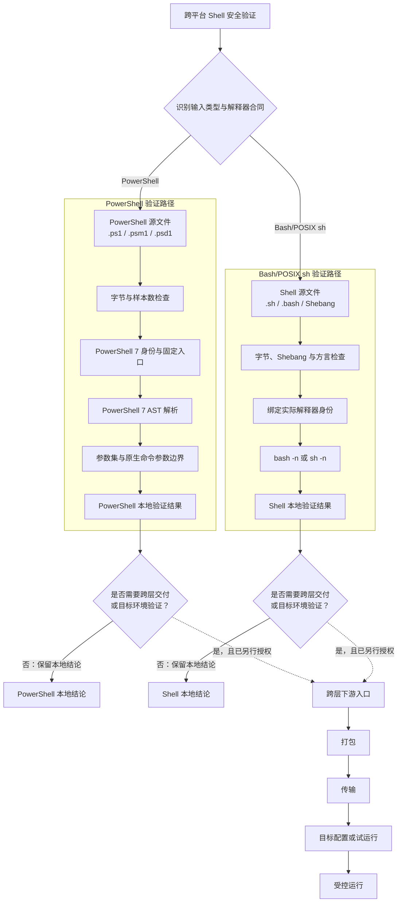
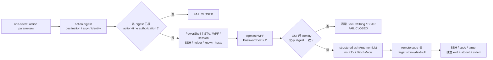

# 跨平台 Shell 安全执行架构

## 状态与用途

- 状态：已采用的项目级设计。
- 用途：定义 `powershell-bash-safety` 的多层解释模型、验证门、权威和停止条件。
- 更新触发：新增解释器、凭据输入面、传输、归档、容器启动责任模式，或确认新的可复用失败原因。

## 执行层

当前结论：同一个“跨平台 Shell 安全验证”入口按输入类型和解释器合同选择一条本地验证路径；跨层交付与目标环境验证是本地结论之后的独立条件分支。

该图表达同一上级下的两条条件分支，不是两套 Skill，也不表示 PowerShell 必然调用 Bash/POSIX sh。两个分支不互相串联；各自选择“否”时保留本地结论，只有选择“是，且已另行授权”时才汇入共同下游。本地解析器 PASS 不自动进入打包、传输、目标环境或运行态。

每一层必须明确：

- 输入字节；
- 变量展开责任；
- 引号处理责任；
- 解释器/工具身份；
- 退出码/结果的采集位置。

无法证明某一层的责任或方言时，停止拼接命令，改用独立脚本、原生命令参数、标准输入、受控环境或参数文件。

## 已授权 sudo 的遮蔽输入路径

该路径不是 parser gate 的延伸，也不由 `Target` 名称自动触发。它只消费已经存在的 action-time authorization，并在 Windows interactive desktop 中把密码输入从 queued/未聚焦 PTY 移到独立 WPF window。

关键合同：

- GUI 只读取两个 `PasswordBox.SecurePassword`，cancel、empty、mismatch、non-Windows、MTA、session 0 或 WPF unavailable 均停止；没有 terminal fallback。
- action digest 绑定 authorization ID、host/user/port、absolute target argv、timeout、`MaxOutputBytes`、OpenSSH/helper SHA-256、`known_hosts` SHA-256 和可选 identity file 的 path/length/UTC mtime。private key 内容不由 helper 读取。
- OpenSSH 关闭 config file、PTY、password/keyboard-interactive prompt 与重试；host key 必须由显式 `known_hosts` 验证。target command 通过确定性 POSIX single-quote contract 进入固定 remote helper，不拼接动态 shell program。
- 值仅短暂存在 WPF/SecureString/BSTR/stream buffers；BSTR 由 `ZeroFreeBSTR` 清理，接受值在所有路径 `Dispose()`。remote work root 不含密码，只含 FIFO 与 outer SSH user 在 sudo 前创建的 non-secret target status，并由 trap 精确删除。
- remote 四个输出流各自最多保留 `MaxOutputBytes`；reader 在截断后继续 drain FIFO，Windows transport 同时对 SSH stdout/stderr 设硬上限，均不使用无界 `ReadToEndAsync`。任一层超限统一 `ErrorLayer=OutputLimit`、`FailureCode=OUTPUT_LIMIT_EXCEEDED`。
- remote protocol 完整时 SSH transport exit 为 0；sudo 与 target exit 另行报告。target 失败不改标为 SSH 失败，protocol 缺失也不冒充 target 结果。

## 验证门模型

| 验证门 | 核心检查 | 不能证明什么 |
| --- | --- | --- |
| 解析器 | PowerShell AST、`bash -n`、`sh -n` | 不能证明远端字节或真实运行 |
| 参数集/原生命令参数 | 参数集、独立参数、即时退出码 | 不能证明远端 Shell 引号处理 |
| 打包 | 成员允许清单、EOL、NUL、SHA-256 | 不能证明上传后仍一致 |
| 传输 | 双端文件集、长度、哈希 | 不能证明启动入口正确 |
| 配置/试运行 | Compose 渲染、启动责任、工具检查 | 不能证明运行态健康 |
| 运行 | 单次受控执行、明确回滚 | 只覆盖本次授权和观测范围 |
| 遮蔽凭据输入 | WPF/STA/session、action digest、stdin-only、内存/FIFO cleanup | 不能产生 sudo 授权，也不能证明 SSH/sudo/target 成功 |

验证门表示按风险升级的条件层，而不是每次调用都必须执行整张表。Fast 合并本地必要检查；Milestone 条件增加静态检查/测试；Target 才绑定真实目标环境。

## 消费者深度选择

| 消费者角色 | 默认 | 条件升级 | 不自动获得 |
| --- | --- | --- | --- |
| 脚本实施者 | 受影响范围 Fast | 适配器/相关逻辑变化进入 Milestone；具体目标获执行时授权后进入 Target | 安装、远程写入、WSL/FNOS/容器、部署或生产执行 |
| 只读审查者 | 审阅源码、解释器合同、已有证据；可选无写入解析器 | 已存在且无项目写入的静态检查 | 测试夹具、文件修改、工具安装、Target 后端或运维脚本 |

角色只是模式选择输入，不是权限传递机制。同一 Skill 对不同消费者选择不同深度；Target 必须同时绑定具体环境和独立授权。代表性任务引用留在项目本地测试计划，不进入规范包。

## 解释器合同

- Windows PowerShell 验证门先绑定 `C:\Program Files\PowerShell\7\pwsh.exe`。固定入口缺失时停止；引导、PATH、Profile、字体和终端改动都属于独立执行时层。
- `.ps1`、`.psm1`、`.psd1` 修改后由包内置验证器执行 AST 解析门；它只读取源码，不执行目标脚本。
- 内置脚本只编排官方 `Parser.ParseFile`；单文件 `ExpectedCount` 固定为 1，目录或路径清单批量必须显式给出正数 `ExpectedCount`。去重后空集合或实际数量不匹配都在解析器前失败。
- 直接 ReparsePoint 目标被拒绝，目录内 ReparsePoint 与约定依赖目录被跳过并计数；Text/Json 共享 `discovered`、`validated`、`skipped`、`parse_errors` 和 0/1/2 退出合同。
- PSScriptAnalyzer 是可选静态检查层，缺失时 `NOT_RUN`；Pester 是适配器测试层；编辑器诊断不是验证门。
- Shell 适配器在 Fast 中绑定唯一 Git Bash/`Explicit` 后端并仅调用 `bash -n`/`sh -n`；Milestone 条件运行已可用 ShellCheck，Target 才允许显式 WSL 发行版或其他目标解释器。
- Git Bash、MSYS2、Windows WSL 启动器与 WSL 内 Shell 是不同身份和路径域；Windows 本地 PASS 不迁移为目标 Linux PASS。
- `#!/usr/bin/env bash`、`set -o pipefail`、数组、`[[ ]]`、进程替换（process substitution）等只能由 Bash 执行。
- `#!/bin/sh` 使用 POSIX 语法与兼容选项，例如 `set -eu`。
- 调用方显式选择解释器；不依赖 Shebang、可执行位或间接工具自动选择正确方言。
- Windows 上先发现并绑定具体 `bash.exe` 身份，再按对应 WSL/MSYS 路径域验证输入。

## 字节与传输合同

- 规范源码、归档成员、上传文件和解压文件是不同身份。
- 归档由二进制安全工具生成，不经过 PowerShell 文本管道。
- `SHA256SUMS` 使用消费者实际看到的相对文件名；清单必须包含所有上传文件且不能包含未上传文件。
- 解压前拒绝绝对路径、`..`、非预期链接和特殊成员；解压后重新验证 EOL、NUL、Shebang、解析器与哈希。

## 主进程责任合同

同时检查镜像 `ENTRYPOINT`/`CMD`、Compose `entrypoint`/`command`、包装脚本与外层监管程序。主进程只能有一个启动责任方；无法证明唯一时失败并停止。

## 失败与恢复

- 只记录首个有效根因、失败层、退出码和脱敏证据。
- 一次只修一个已证实原因，并从最早失败验证门重验。
- `ROLLED_BACK` 只表示合同登记的副作用已恢复；新建目录、输出、项目、网络、容器或端口仍需逐项重新核对。
- 发现残留时保留现场并停止；不得通过覆盖、复用、改名或未经授权删除继续。

## 权威边界

- Skill 源码、安装镜像、Git 检查点、真实远程环境和生产操作是独立层。
- 验证或授权不会自动跨层传递。
- 文档与测试不得读取密码、凭据、业务正文或输出完整敏感日志。
- synthetic tests 可以使用明确 sentinel；不得读取 chat、真实 history、environment 中的 secret，或连接真实 SSH/sudo/FNOS 来证明本地合同。
- 规范验证器、旧用户级工具副本、已安装 Skill 镜像和机器 Shell 环境是不同身份；源码候选通过验证不授权覆盖后三者。
- MCP 消息审批、空回传与任务唤醒不是解析器、静态检查或 Target 兼容性结论；没有外部证据时保持 `UNKNOWN`。
