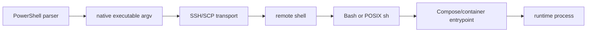

# 跨平台 Shell 安全执行架构

## 状态与用途

- 状态：已采用的项目级设计。
- 用途：定义 `powershell-bash-safety` 的多层解释模型、验证 gate、authority 和停止条件。
- 更新触发：新增 interpreter、transport、archive、container owner 模式，或确认新的可复用失败原因。

## 执行层

该图只表达命令跨越的解释与交付顺序；任一节点 PASS 都不自动证明后续节点。

每一层必须明确：

- input bytes；
- 变量展开 owner；
- quoting owner；
- interpreter/tool identity；
- exit/result 的采集位置。

无法证明某一层的 owner 或 dialect 时，停止拼接命令，改用独立脚本、argv、stdin、受控 environment 或参数文件。

## Gate 模型

| Gate | 核心检查 | 不能证明什么 |
| --- | --- | --- |
| Parser | PowerShell AST、`bash -n`、`sh -n` | 不能证明远端字节或真实运行 |
| Parameter/argv | parameter set、独立 argv、即时 exit code | 不能证明远端 shell quoting |
| Package | member allowlist、EOL、NUL、SHA-256 | 不能证明上传后仍一致 |
| Transport | 双端 file set、length、hash | 不能证明 entrypoint 正确 |
| Config/dry-run | Compose render、owner、tool check | 不能证明 runtime health |
| Runtime | 单次受控执行、明确 rollback | 只覆盖本次授权和观测范围 |

Gate 表示按风险升级的条件层，而不是每次调用都必须执行整张表。Fast 合并本地必要检查；Milestone 条件增加 lint/tests；Target 才绑定真实目标环境。

## 消费者深度选择

| Consumer role | 默认 | 条件升级 | 不自动获得 |
| --- | --- | --- | --- |
| 脚本实施者 | 受影响范围 Fast | adapter/相关逻辑变化进入 Milestone；具体目标获 action-time authorization 后进入 Target | 安装、远程写入、WSL/FNOS/container、部署或生产执行 |
| 只读审查者 | 审阅 source、interpreter contract、已有 evidence；可选无写入 parser | 已存在且无项目写入的 lint | fixture tests、文件修改、工具安装、Target backend 或运维脚本 |

角色只是 mode-selection 输入，不是权限传递机制。同一 Skill 对不同消费者选择不同深度；Target 必须同时绑定具体环境和独立授权。代表性 task reference 留在项目本地测试计划，不进入 canonical package。

## Interpreter 合同

- Windows PowerShell gate 先绑定 `C:\Program Files\PowerShell\7\pwsh.exe`。固定入口缺失时停止；bootstrap、PATH、Profile、字体和终端改动都属于独立 action-time layer。
- `.ps1`、`.psm1`、`.psd1` 修改后由 package 内置验证器做 AST parser gate；它只读取源码，不执行目标脚本。
- 内置脚本只编排官方 `Parser.ParseFile`；单文件 expected count 固定为 1，目录或 path list 批量必须显式给出正数 expected count。去重后空集合或 actual mismatch 都在 parser 前失败。
- 直接 ReparsePoint target 被拒绝，目录内 ReparsePoint 与约定依赖目录被跳过并计数；Text/Json 共享 discovered、validated、skipped、parse_errors 和 0/1/2 exit contract。
- PSScriptAnalyzer 是可选 lint layer，缺失时 `NOT_RUN`；Pester 是 adapter test layer；编辑器诊断不是 gate。
- Shell adapter 在 Fast 中绑定唯一 Git Bash/Explicit backend 并仅调用 `bash -n`/`sh -n`；Milestone 条件运行已可用 ShellCheck，Target 才允许显式 WSL distribution 或其他目标 interpreter。
- Git Bash、MSYS2、Windows WSL launcher 与 WSL 内 shell 是不同 identity 和 path domain；Windows local PASS 不迁移为目标 Linux PASS。
- `#!/usr/bin/env bash`、`set -o pipefail`、数组、`[[ ]]`、process substitution 等只能由 Bash 执行。
- `#!/bin/sh` 使用 POSIX 语法与兼容选项，例如 `set -eu`。
- 调用方显式选择 interpreter；不依赖 shebang、可执行位或间接工具自动选择正确 dialect。
- Windows 上先发现并绑定具体 `bash.exe` identity，再按对应 WSL/MSYS 路径域验证输入。

## Byte 与 transport 合同

- Canonical source、archive member、uploaded file 和 extracted file 是不同 identity。
- archive 由 binary-safe 工具生成，不经过 PowerShell 文本管道。
- `SHA256SUMS` 使用消费者实际看到的相对文件名；清单必须包含所有上传文件且不能包含未上传文件。
- 解压前拒绝绝对路径、`..`、非预期链接和特殊成员；解压后重新验证 EOL、NUL、shebang、parser 与 hash。

## Process owner 合同

同时检查 image `ENTRYPOINT`/`CMD`、Compose `entrypoint`/`command`、wrapper 与外层 supervisor。主进程只能有一个启动 owner；无法证明唯一时 fail closed。

## 失败与恢复

- 只记录首个有效根因、失败层、exit code 和脱敏证据。
- 一次只修一个已证实原因，并从最早失败 gate 重验。
- `ROLLED_BACK` 只表示合同登记的副作用已恢复；新建目录、output、project、network、container 或 port 仍需逐项 fresh 核对。
- 发现残留时保留现场并停止；不得通过覆盖、复用、改名或未经授权删除继续。

## Authority 边界

- Skill source、installed mirror、Git checkpoint、真实远程环境和生产操作是独立层。
- 验证或授权不会自动跨层传递。
- 文档与测试不得读取密码、Credential、业务正文或输出完整敏感日志。
- canonical validator、旧用户级工具副本、installed Skill mirror 和机器 shell 环境是不同 identity；源码候选通过验证不授权覆盖后三者。
- MCP 消息审批、空回传与任务唤醒不是 parser、lint 或 target compatibility 结论；没有外部证据时保持 `UNKNOWN`。
